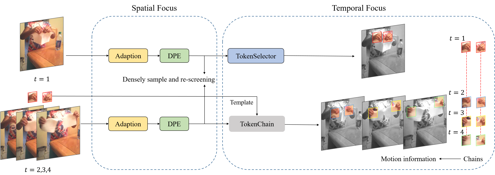

# STFM

This repo is one implementation version of ‘STFM: A Spatiotemporal Focus Module for Video Recognition’, based on Uniformer.

# Introduction

STFM (Spatiotemporal Focus Module) is a plug-and-play module for video recognition, which can ameliorate the spatiotemporal focusing capabilities of transformer models. In the Spatial Focus part, STFM breaks patch boundaries by densely patch embedding and adaptively selects certain patch tokens that can participate in subsequent transformer layers. In the Temporal Focus part, STFM aligns semantically similar patches in the time dimension to form semantic similarity chains. 

We embed STFM in several popular methods, including UniFormer, TimeSformer, and MViTv2, and retrain them on Kinetics-400 and Something-Something V2 datasets, these models achieve varying degrees of promotion compared with the original models.



We evaluate STFM on several methods, we only provide the implementation of STFM embedding UniFormer here.

# Main Results and Model Zoo

We show our results here and release the [code](https://github.com/JieHarry-Hu/STFM) and [models](https://drive.google.com/drive/folders/1eJEdpdG3SlK0OEClmg4bUT5CXoEy3UfS) for Kinetics 400 and Something-Something V2.

The initialized weights can be downloaded from [UniFormer](https://github.com/Sense-X/UniFormer/tree/main/video_classification).

All trained models are [here](https://drive.google.com/drive/folders/1eJEdpdG3SlK0OEClmg4bUT5CXoEy3UfS).

## Kinetics-400

| Model | Frame*View | Token | GFLOPs | Top-1 | Link |
| --- | --- | --- | --- | --- | --- |
| STFM+UniFormer-S | 16*1*4 | 16 | 495 | 82.2(+1.4) | [Google](https://drive.google.com/drive/folders/1Kcp20b6V2kkLnIYtyz6G9nW_ihl2zS4o) |
| STFM+UniFormer-B | 16*1*4 | 64 | 752 | 83.5(+1.5) | [Google](https://drive.google.com/drive/folders/1KBaHlUDSPJyYGv_V49k9yS6zvn4fL223) |
| STFM+UniFormer-B | 32*3*4 | 64 | 5052 | 84.2(+1.2) | [Google](https://drive.google.com/drive/folders/16vPnXC9DvPJXxWNsLDFpyE-gFaqxHcmo) |

## Something-Something V2

| Model | Pretrain | Frame*View | Token | GFLOPs | Top-1 | Link |
| --- | --- | --- | --- | --- | --- | --- |
| STFM+UniFormer-S | K400 | 16*3*1 | 16 | 371 | 69.7(+2.0) | [Google](https://drive.google.com/drive/folders/1icl3TYS-zOhpkRMYXoLXI-CARyqBD_hT) |
| STFM+UniFormer-S | K600 | 16*3*1 | 16 | 378 | 71.0(+1.6) | [Google](https://drive.google.com/drive/folders/1TpuKaCiur8NSSgIiUXZfZpp30kqF5qcA) |
| STFM+UniFormer-B | K400 | 16*3*1 | 64 | 565 | 72.2(+1.8) | [Google](https://drive.google.com/drive/folders/18y0AMTLvdCKKGiENzmpUUQ-3fEhW_Fbv) |
| STFM+UniFormer-B | K400 | 32*3*1 | 64 | 1354 | 72.5(+1.3) | [Google](https://drive.google.com/drive/folders/1Sy9eywhJ1ujrfZjeoEY20weWRXhY1AEN) |

# Usage

## Installation and Datasets

Please follow the installation instructions in [INSTALL.md](https://github.com/JieHarry-Hu/STFM/blob/main/INSTALL.md). You may follow the instructions in [DATASET.md](https://github.com/JieHarry-Hu/STFM/blob/main/DATASET.md) to prepare the datasets.

## Train

1. Download the models in our repository.
2. Simply run the training scripts in [exp](https://github.com/JieHarry-Hu/STFM/tree/main/exp) as followed:

```bash
bash ./exp/uniformer_s8x8_k400/run.sh
```

- Note!

Due to 1 GPU used, we use Gradient Accumulation in our training process.

We provide the switch to freeze the backbone before STFM, you only need to set:

```bash
MODEL.FINETUNNING = True
```

Notes that models trained with freezing partly backbone will perform slightly worse than without freezing, but this method trains faster and is more memory friendly.

In different models, you need to change the hyperparameters of STFM to set the number of tokens selected:

```bash
STFM.NUM_TOKENS = 64  #for base variants
STFM.NUM_TOKENS = 16  #for small variants
```

## Test

1. You need to download our trained models or train your own models, and set the checkpoint path via:
    
    ```bash
    TEST.CHECKPOINT_FILE_PATH your_model_path
    ```
    
2. Testing example is as followed:
    
    ```bash
    bash ./exp/uniformer_s8x8_k400/test.sh
    ```
    

# **Acknowledgment**

This repository is built based on [UniFormer](https://github.com/Sense-X/UniFormer/tree/main/video_classification) repository. Thanks for their work.